# Kartográfusok - magyar
 
English version below

Heló! Köszöntelek a Kartográfusok társasjáték online megvalósított játékának projektkönyvtárában. Az alkalmazást szakdolgozatom keretein belül készítettem el.

> A játék látványképei megtalálhatók a **"látvány"** mappában illetve ezen *markdown* legalján.

# Fájlrendszer

A projekt rendszer három főbb komponensből áll. A kliensoldali front-end programot a **"kartografusok_frontend"** mappa tartalmazza, a back-end logika megvalósítása a **"kartografusok_backed"** útvonal alatt történt, a játék során a kapcsolatot tartó socket projekt a **"kartografusok_socketio"** mappában van. Egy negyedik "látvány" mappában a már említett látványképek láthatók.

# Függőségek telepítése

A három komponens npm csomagkezelő rendszert használ, a függőségeiket az **"npm i"** parancs segítségével lehet feltelepíteni, amennyiben valamelyik komponens mappájában állunk. Ennek az egyszerűsítése kedvéért a projekt gyökérkönyvtárában elhelyeztem egy **"install.bat"** állományt, ami három különböző állományra oszlik, amelyek elvégzik helyettünk a megfelelő mappába lépés és parancs kiadás folyamatát. Ezáltal települ mindhárom komponens összes függősége.

## Verziók

Node - v18.14.1 az általam használt, és ilyen beállításban az alkalmazás garantáltan helyes működéséhez szükséges csomagkezelő verziója.

További verziók az alkalmazásban:

- NPM - 9.3.1
- React - ^18.2.0
- React-dom - ^18.2.0
- React-redux - ^8.0.4
- socket-io - ^4.0.1 
- sqlite - ^5.0.2
- nestjs - ^9.0.0

# Futtatás

A függőségek telepítését követően, ahhoz hasonlóan, az egyes főkomponensek mappájában állva az **"npm start"** parancsot kiadva elindul az alkalmazás. Ennek az egyszerűsítésére szitén elhelyeztem egy állományt a gyökérkönyvtárban, ami a **"start.bat"** névre hallgat. Ennek futtatásakor elindul mind a három komponens.

A három komponens nem meghatározott sorrendben indul el, ezért elképzelhető, hogy ha például a frontend megelőzi a backendet, akkor a böngészőben újra kell tölteni az oldalt az adatok (pl: képek) helyes megjelenítéséért.

> A React alkalmazás a 3001-es, a back-end alkalmazás a 3000-es, a Socket alkalmazás pedig a 3030-as porton indul el alapértelmezetten.

# Cartographers - english

Hello! Welcome to the project directory of the online implementation of the board game "Cartographers". I developed the application as part of my university thesis.

> The game images can be found in the **"látvány"** folder.

# Project directory

The project consists of three main components. The client-side front-end program is located in the **"cartographers_frontend"** folder, the back-end logic is implemented in the **"cartographers_backend"** path, and the socket project that maintains the connection during the game is located in the **"cartographers_socketio"** folder. A fourth "látvány" folder contains the mentioned game images.

## Installing dependencies

Each of the three components use the npm package manager, and their dependencies can be installed using the **"npm i"** command while standing in the directory of the given component. For simplification, I placed an **"install.bat"** file in the project's root directory that runs three separate files, each of which takes care of navigating to the correct folder and executing the necessary command. This way, all dependencies of all three components can be installed at once.

## Versions

Node - v18.14.1 is the version of the package manager I used, and it is garanteed that in this setting the application functions correctly.

Other versions used in the application are:

- NPM - 9.3.1
- React - ^18.2.0
- React-dom - ^18.2.0
- React-redux - ^8.0.4
- socket-io - ^4.0.1 
- sqlite - ^5.0.2
- nestjs - ^9.0.0

# Running

After installing the dependencies, the application can be started by standing in the directory of the given component and issuing the **"npm start"** command. Similarly, for simplification, I placed a file called **"start.bat"** in the root directory, which starts all three components at once.

The three components can start in any order, so it is possible that if the frontend precedes the backend, for example, the page must be reloaded in the browser for the data (e.g. images) to be displayed correctly.

> The React application runs on port 3001, the back-end application on port 3000, and the Socket application on port 3030 by default.

# Látvány / Visuals

  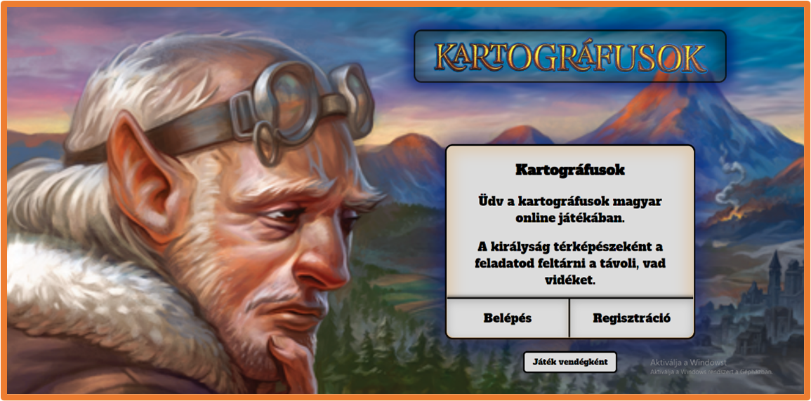
  Főképernyő | Main screen

  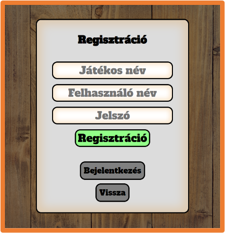
  Regisztráció | Registration

  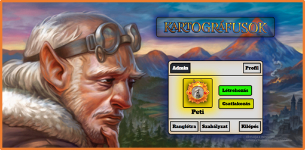
  Bejelentkezett képernyő | Logged in screen

  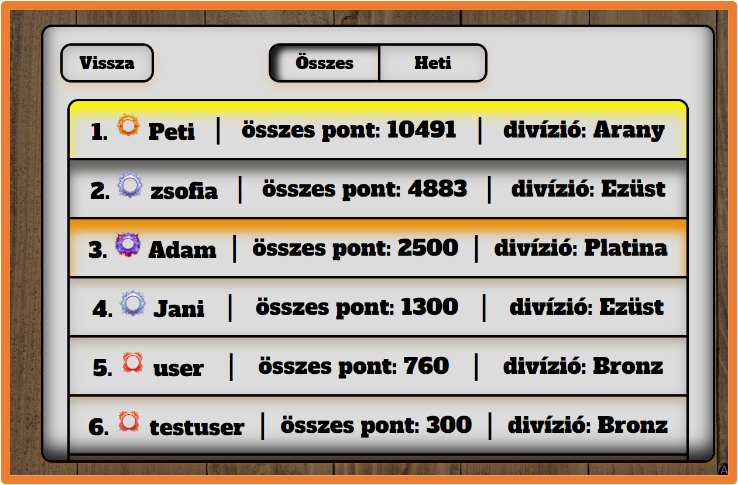
  Ranglétra | Leaderboard

  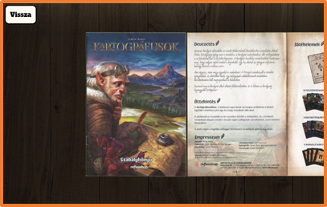
  Szabályok | Rules

  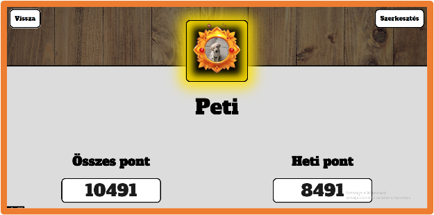
  Profil oldal | Profile page

  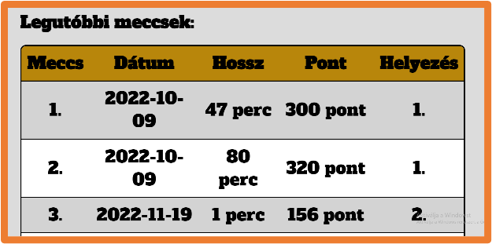
  Egy felhasználó korábbi meccsei | User's match history

  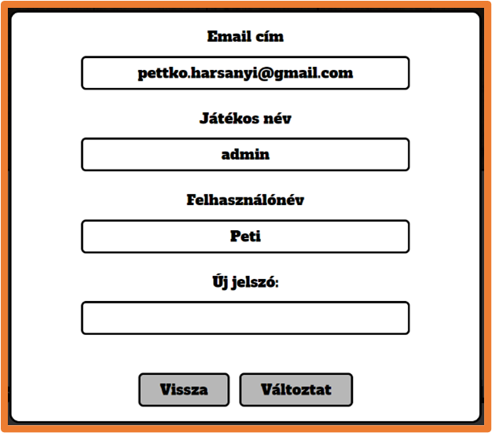
  Felhasználó módosítása | Modify user

  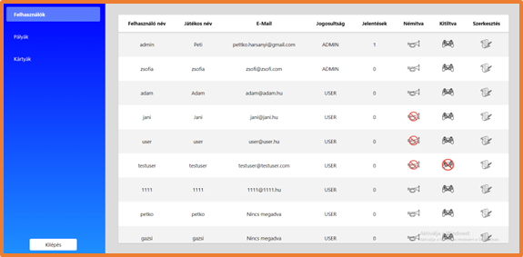
  Admin oldal | Admin page

  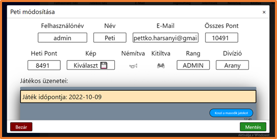
  Adminként felhasználó módosítás | Modify user by Admin

  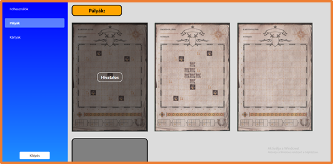
  Adminként pálya hozzáadás, módosítás | Add, modify maps by Admin

  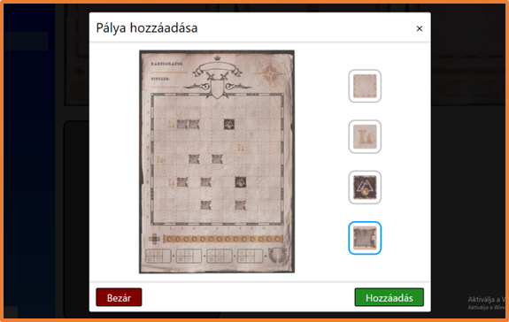
  A pálya szerkesztő panel | The map modify panel

  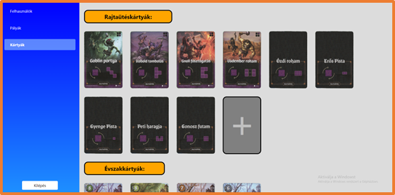
  Adminként kártya hozzáadás | Add cards by Admin

  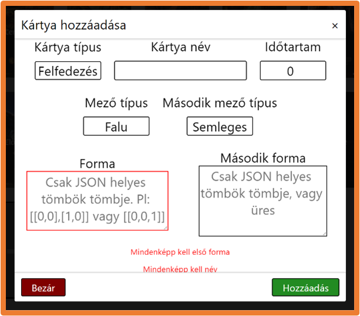
  A kártya hozzáadó panel | The card add panel

  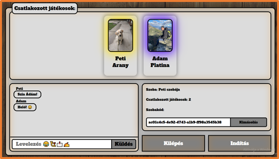
  Szoba létrehozása | Create room

  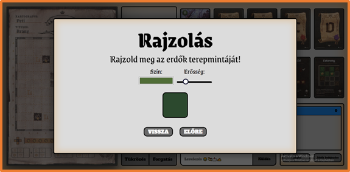
  Játék eleje, rajzolás | Drawing, the start of a game

  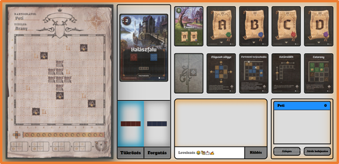
  A játék | The game

  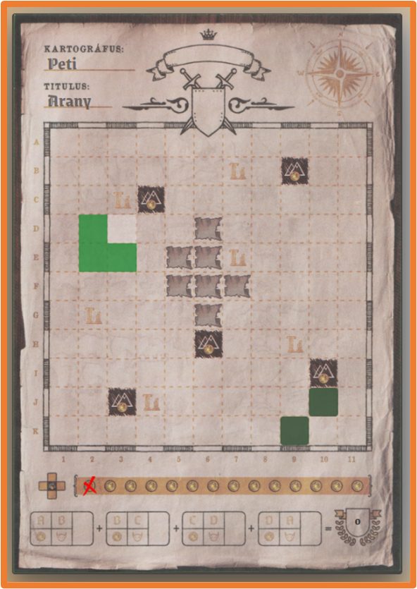
  Pálya a játékon belül | Map of the game

  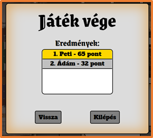
  Játék vége, pontszámok | End of the game, results

  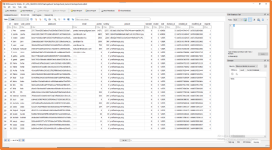
  Adatbázis | Database

  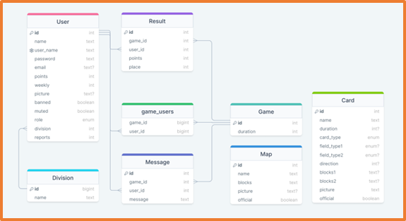
  Adatbázis kapcsolatok | Database relations

